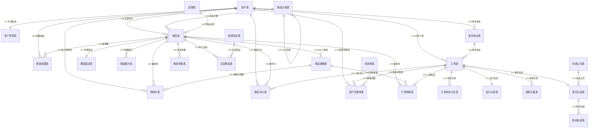
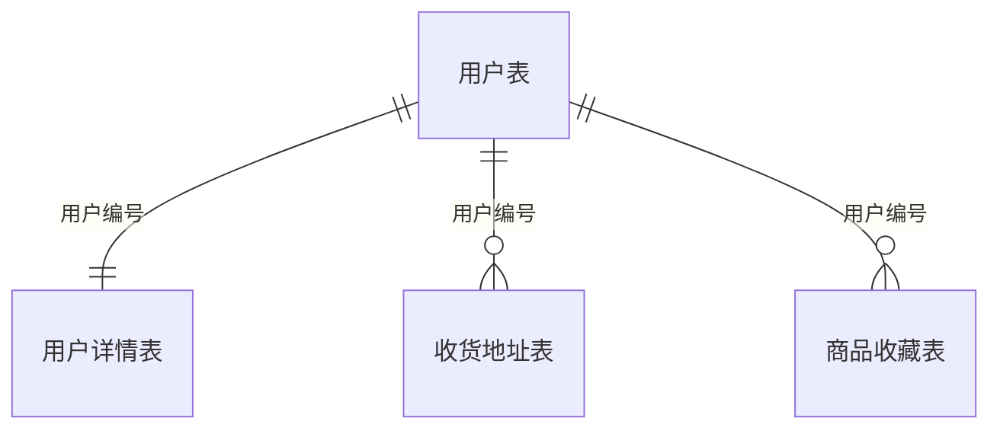
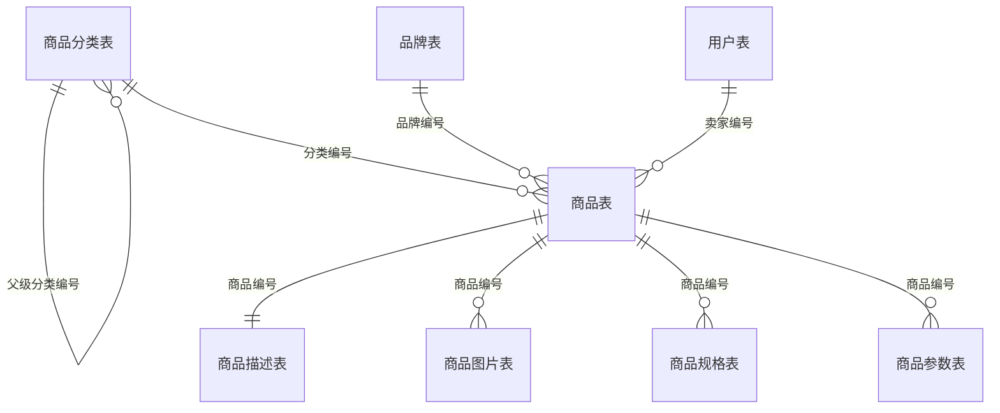
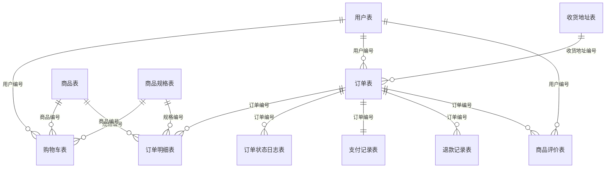
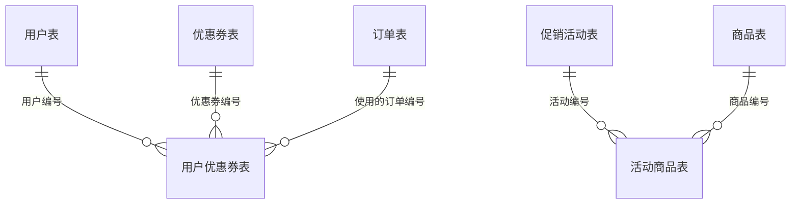
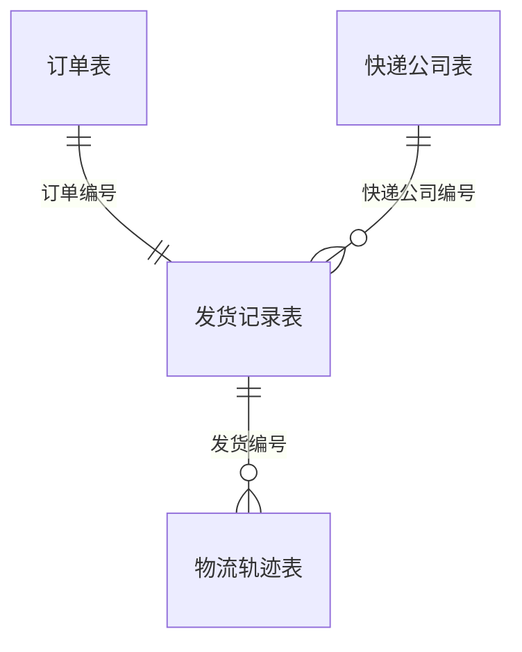

# 淘宝商城数据库 ER 图

## 整体 ER 图（25张表）

---

## 分模块 ER 图

### 一、用户模块（4张表）

### 二、商品模块（7张表）

### 三、订单模块（7张表）

### 四、营销模块（4张表）

### 五、物流模块（3张表）

---

## 各表字段清单

### 用户模块

| 表名 | 主键 | 核心字段 |
|------|------|----------|
| 用户表 | 用户编号(PK) | 用户名、密码密文、手机号、邮箱、头像URL、用户角色、账户状态、注册时间、最后登录时间 |
| 用户详情表 | 用户编号(PK,FK) | 真实姓名、性别、出生日期、昵称、个人简介、身份证号脱敏、更新时间 |
| 收货地址表 | 地址编号(PK) | 用户编号(FK)、收货人姓名、联系电话、省份、城市、区县、详细地址、邮政编码、是否默认地址、创建时间 |
| 商品收藏表 | 收藏编号(PK) | 用户编号(FK)、商品编号(FK)、收藏时间 |

### 商品模块

| 表名 | 主键 | 核心字段 |
|------|------|----------|
| 商品分类表 | 分类编号(PK) | 分类名称、父级分类编号(FK)、分类层级、排序序号、是否叶子节点、图标URL、创建时间 |
| 品牌表 | 品牌编号(PK) | 品牌名称、品牌LOGO_URL、品牌首字母、所属国家、品牌故事简介、状态、创建时间 |
| 商品表 | 商品编号(PK) | 卖家编号(FK)、分类编号(FK)、品牌编号(FK)、商品标题、副标题、主图URL、最低价格、最高价格、总库存量、销量、商品状态、是否新品、创建时间、更新时间 |
| 商品描述表 | 描述编号(PK) | 商品编号(UK,FK)、PC端描述HTML、移动端描述HTML、售后服务说明、包装清单、更新时间 |
| 商品图片表 | 图片编号(PK) | 商品编号(FK)、图片URL、排序序号、是否主图、上传时间 |
| 商品规格表 | 规格编号(PK) | 商品编号(FK)、规格名称、规格值、销售价格、库存数量、规格编码、是否启用、创建时间 |
| 商品参数表 | 参数编号(PK) | 商品编号(FK)、属性名称、属性值、排序序号、创建时间 |

### 订单模块

| 表名 | 主键 | 核心字段 |
|------|------|----------|
| 购物车表 | 购物车编号(PK) | 用户编号(FK)、商品编号(FK)、规格编号(FK)、购买数量、是否选中、加入时间 |
| 订单表 | 订单编号(PK) | 订单流水号(UK)、用户编号(FK)、收货地址编号(FK)、商品总金额、运费金额、实付金额、订单状态、买家留言、支付时间、发货时间、完成时间、取消原因、创建时间、更新时间 |
| 订单明细表 | 明细编号(PK) | 订单编号(FK)、商品编号(FK)、规格编号(FK)、商品标题快照、规格名称快照、成交单价快照、购买数量、小计金额、商品图片快照、是否已评价 |
| 订单状态日志表 | 日志编号(PK) | 订单编号(FK)、变更前状态、变更后状态、操作人类型、操作人编号、备注说明、操作时间 |
| 支付记录表 | 支付编号(PK) | 订单编号(UK,FK)、支付流水号(UK)、支付金额、支付方式、支付状态、第三方交易号、支付时间、创建时间 |
| 退款记录表 | 退款编号(PK) | 订单编号(FK)、退款金额、退款原因、退款说明、凭证图片、退款状态、商家拒绝原因、申请时间、处理时间、完成时间 |
| 商品评价表 | 评价编号(PK) | 订单编号(FK)、商品编号(FK)、用户编号(FK)、评分、评价内容、晒图图片、商家回复内容、是否匿名评价、有用计数、回复时间、评价时间 |

### 营销模块

| 表名 | 主键 | 核心字段 |
|------|------|----------|
| 优惠券表 | 优惠券编号(PK) | 优惠券名称、优惠券类型、使用门槛金额、减免金额或折扣率、发放总量、已领取量、已使用量、每人限领数量、有效期起始时间、有效期结束时间、优惠券状态、创建时间 |
| 用户优惠券表 | 记录编号(PK) | 用户编号(FK)、优惠券编号(FK)、优惠券状态、使用的订单编号(FK)、领取时间、使用时间 |
| 促销活动表 | 活动编号(PK) | 活动名称、活动类型、活动描述、活动起始时间、活动结束时间、活动规则JSON、活动状态、创建时间 |
| 活动商品表 | 记录编号(PK) | 活动编号(FK)、商品编号(FK)、活动价格、每人限购数量、活动库存、已售数量、创建时间 |

### 物流模块

| 表名 | 主键 | 核心字段 |
|------|------|----------|
| 快递公司表 | 快递公司编号(PK) | 快递公司名称(UK)、快递公司代码(UK)、客服电话、官网URL、排序序号、是否启用 |
| 发货记录表 | 发货编号(PK) | 订单编号(UK,FK)、快递公司编号(FK)、快递单号、发货人姓名、发货人电话、发货地址、收货人姓名、收货人电话、收货地址、运费金额、发货状态、发货时间、签收时间、创建时间 |
| 物流轨迹表 | 轨迹编号(PK) | 发货编号(FK)、轨迹描述、轨迹状态、所在城市、操作时间 |

---

## 表间关系清单

| 序号 | 子表（外键方） | 父表（主键方） | 关系 | 外键字段 |
|------|---------------|---------------|------|----------|
| 1 | 用户详情表 | 用户表 | 1:1 | 用户编号 |
| 2 | 收货地址表 | 用户表 | N:1 | 用户编号 |
| 3 | 商品收藏表 | 用户表 | N:1 | 用户编号 |
| 4 | 商品收藏表 | 商品表 | N:1 | 商品编号 |
| 5 | 商品分类表 | 商品分类表 | 自关联 | 父级分类编号 |
| 6 | 商品表 | 用户表 | N:1 | 卖家编号 |
| 7 | 商品表 | 商品分类表 | N:1 | 分类编号 |
| 8 | 商品表 | 品牌表 | N:1 | 品牌编号 |
| 9 | 商品描述表 | 商品表 | 1:1 | 商品编号 |
| 10 | 商品图片表 | 商品表 | N:1 | 商品编号 |
| 11 | 商品规格表 | 商品表 | N:1 | 商品编号 |
| 12 | 商品参数表 | 商品表 | N:1 | 商品编号 |
| 13 | 购物车表 | 用户表 | N:1 | 用户编号 |
| 14 | 购物车表 | 商品表 | N:1 | 商品编号 |
| 15 | 购物车表 | 商品规格表 | N:1 | 规格编号 |
| 16 | 订单表 | 用户表 | N:1 | 用户编号 |
| 17 | 订单表 | 收货地址表 | N:1 | 收货地址编号 |
| 18 | 订单明细表 | 订单表 | N:1 | 订单编号 |
| 19 | 订单明细表 | 商品表 | N:1 | 商品编号 |
| 20 | 订单明细表 | 商品规格表 | N:1 | 规格编号 |
| 21 | 订单状态日志表 | 订单表 | N:1 | 订单编号 |
| 22 | 支付记录表 | 订单表 | 1:1 | 订单编号 |
| 23 | 退款记录表 | 订单表 | N:1 | 订单编号 |
| 24 | 商品评价表 | 订单表 | N:1 | 订单编号 |
| 25 | 商品评价表 | 商品表 | N:1 | 商品编号 |
| 26 | 商品评价表 | 用户表 | N:1 | 用户编号 |
| 27 | 用户优惠券表 | 用户表 | N:1 | 用户编号 |
| 28 | 用户优惠券表 | 优惠券表 | N:1 | 优惠券编号 |
| 29 | 用户优惠券表 | 订单表 | N:1 | 使用的订单编号 |
| 30 | 活动商品表 | 促销活动表 | N:1 | 活动编号 |
| 31 | 活动商品表 | 商品表 | N:1 | 商品编号 |
| 32 | 发货记录表 | 订单表 | 1:1 | 订单编号 |
| 33 | 发货记录表 | 快递公司表 | N:1 | 快递公司编号 |
| 34 | 物流轨迹表 | 发货记录表 | N:1 | 发货编号 |

---

## 表汇总

| 模块 | 表名 | 主键 | 测试数据行数 |
|------|------|------|-------------|
| 用户 | 用户表 | 用户编号 | 8 |
| 用户 | 用户详情表 | 用户编号 | 8 |
| 用户 | 收货地址表 | 地址编号 | 15 |
| 用户 | 商品收藏表 | 收藏编号 | 8 |
| 商品 | 商品分类表 | 分类编号 | 10 |
| 商品 | 品牌表 | 品牌编号 | 5 |
| 商品 | 商品表 | 商品编号 | 10 |
| 商品 | 商品描述表 | 描述编号 | 10 |
| 商品 | 商品图片表 | 图片编号 | 30 |
| 商品 | 商品规格表 | 规格编号 | 30 |
| 商品 | 商品参数表 | 参数编号 | 27 |
| 订单 | 购物车表 | 购物车编号 | 6 |
| 订单 | 订单表 | 订单编号 | 8 |
| 订单 | 订单明细表 | 明细编号 | 12 |
| 订单 | 订单状态日志表 | 日志编号 | 20 |
| 订单 | 支付记录表 | 支付编号 | 5 |
| 订单 | 退款记录表 | 退款编号 | 2 |
| 订单 | 商品评价表 | 评价编号 | 5 |
| 营销 | 优惠券表 | 优惠券编号 | 3 |
| 营销 | 用户优惠券表 | 记录编号 | 5 |
| 营销 | 促销活动表 | 活动编号 | 3 |
| 营销 | 活动商品表 | 记录编号 | 6 |
| 物流 | 快递公司表 | 快递公司编号 | 5 |
| 物流 | 发货记录表 | 发货编号 | 4 |
| 物流 | 物流轨迹表 | 轨迹编号 | 12 |
| **合计** | **25 张表** | | **281 条** |
