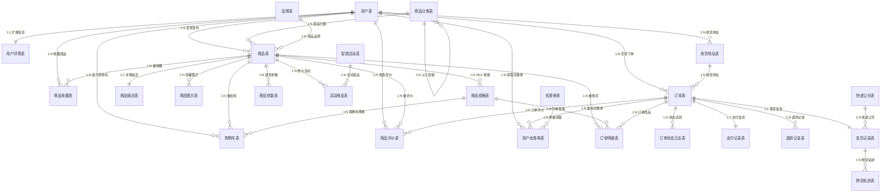
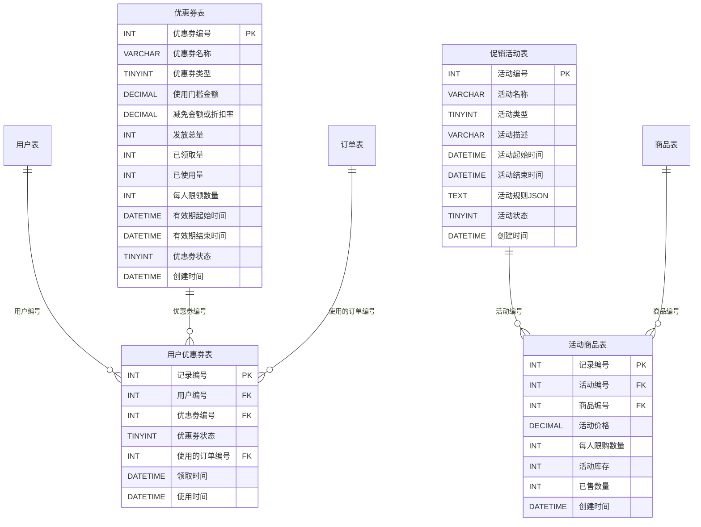

# 淘宝商城数据库 ER 图

## 整体 ER 图



---

## 分模块 ER 图

### 一、用户模块（4张表）

```mermaid
erDiagram
    用户表 {
        INT 用户编号 PK
        VARCHAR 用户名
        VARCHAR 密码密文
        VARCHAR 手机号
        VARCHAR 邮箱
        VARCHAR 头像URL
        TINYINT 用户角色
        TINYINT 账户状态
        DATETIME 注册时间
        DATETIME 最后登录时间
    }
    用户详情表 {
        INT 用户编号 PK_FK
        VARCHAR 真实姓名
        TINYINT 性别
        DATE 出生日期
        VARCHAR 昵称
        VARCHAR 个人简介
        VARCHAR 身份证号脱敏
        DATETIME 更新时间
    }
    收货地址表 {
        INT 地址编号 PK
        INT 用户编号 FK
        VARCHAR 收货人姓名
        VARCHAR 联系电话
        VARCHAR 省份
        VARCHAR 城市
        VARCHAR 区县
        VARCHAR 详细地址
        VARCHAR 邮政编码
        TINYINT 是否默认地址
        DATETIME 创建时间
    }
    商品收藏表 {
        INT 收藏编号 PK
        INT 用户编号 FK
        INT 商品编号 FK
        DATETIME 收藏时间
    }
    用户表 ||--|| 用户详情表 : "用户编号"
    用户表 ||--o{ 收货地址表 : "用户编号"
    用户表 ||--o{ 商品收藏表 : "用户编号"
```

### 二、商品模块（7张表）

```mermaid
erDiagram
    商品分类表 {
        INT 分类编号 PK
        VARCHAR 分类名称
        INT 父级分类编号 FK
        TINYINT 分类层级
        INT 排序序号
        TINYINT 是否叶子节点
        VARCHAR 图标URL
        DATETIME 创建时间
    }
    品牌表 {
        INT 品牌编号 PK
        VARCHAR 品牌名称
        VARCHAR 品牌LOGO_URL
        CHAR 品牌首字母
        VARCHAR 所属国家
        TEXT 品牌故事简介
        TINYINT 状态
        DATETIME 创建时间
    }
    商品表 {
        INT 商品编号 PK
        INT 卖家编号 FK
        INT 分类编号 FK
        INT 品牌编号 FK
        VARCHAR 商品标题
        VARCHAR 副标题
        VARCHAR 主图URL
        DECIMAL 最低价格
        DECIMAL 最高价格
        INT 总库存量
        INT 销量
        TINYINT 商品状态
        TINYINT 是否新品
        DATETIME 创建时间
        DATETIME 更新时间
    }
    商品描述表 {
        INT 描述编号 PK
        INT 商品编号 UK_FK
        LONGTEXT PC端描述HTML
        LONGTEXT 移动端描述HTML
        TEXT 售后服务说明
        VARCHAR 包装清单
        DATETIME 更新时间
    }
    商品图片表 {
        INT 图片编号 PK
        INT 商品编号 FK
        VARCHAR 图片URL
        INT 排序序号
        TINYINT 是否主图
        DATETIME 上传时间
    }
    商品规格表 {
        INT 规格编号 PK
        INT 商品编号 FK
        VARCHAR 规格名称
        VARCHAR 规格值
        DECIMAL 销售价格
        INT 库存数量
        VARCHAR 规格编码
        TINYINT 是否启用
        DATETIME 创建时间
    }
    商品参数表 {
        INT 参数编号 PK
        INT 商品编号 FK
        VARCHAR 属性名称
        VARCHAR 属性值
        INT 排序序号
        DATETIME 创建时间
    }
    商品分类表 ||--o{ 商品分类表 : "父级分类编号"
    商品分类表 ||--o{ 商品表 : "分类编号"
    品牌表 ||--o{ 商品表 : "品牌编号"
    用户表 ||--o{ 商品表 : "卖家编号"
    商品表 ||--|| 商品描述表 : "商品编号"
    商品表 ||--o{ 商品图片表 : "商品编号"
    商品表 ||--o{ 商品规格表 : "商品编号"
    商品表 ||--o{ 商品参数表 : "商品编号"
```

### 三、订单模块（7张表）

```mermaid
erDiagram
    购物车表 {
        INT 购物车编号 PK
        INT 用户编号 FK
        INT 商品编号 FK
        INT 规格编号 FK
        INT 购买数量
        TINYINT 是否选中
        DATETIME 加入时间
    }
    订单表 {
        INT 订单编号 PK
        VARCHAR 订单流水号
        INT 用户编号 FK
        INT 收货地址编号 FK
        DECIMAL 商品总金额
        DECIMAL 运费金额
        DECIMAL 实付金额
        TINYINT 订单状态
        VARCHAR 买家留言
        DATETIME 支付时间
        DATETIME 发货时间
        DATETIME 完成时间
        VARCHAR 取消原因
        DATETIME 创建时间
        DATETIME 更新时间
    }
    订单明细表 {
        INT 明细编号 PK
        INT 订单编号 FK
        INT 商品编号 FK
        INT 规格编号 FK
        VARCHAR 商品标题快照
        VARCHAR 规格名称快照
        DECIMAL 成交单价快照
        INT 购买数量
        DECIMAL 小计金额
        VARCHAR 商品图片快照
        TINYINT 是否已评价
    }
    订单状态日志表 {
        INT 日志编号 PK
        INT 订单编号 FK
        TINYINT 变更前状态
        TINYINT 变更后状态
        TINYINT 操作人类型
        INT 操作人编号
        VARCHAR 备注说明
        DATETIME 操作时间
    }
    支付记录表 {
        INT 支付编号 PK
        INT 订单编号 UK_FK
        VARCHAR 支付流水号
        DECIMAL 支付金额
        TINYINT 支付方式
        TINYINT 支付状态
        VARCHAR 第三方交易号
        DATETIME 支付时间
        DATETIME 创建时间
    }
    退款记录表 {
        INT 退款编号 PK
        INT 订单编号 FK
        DECIMAL 退款金额
        VARCHAR 退款原因
        TEXT 退款说明
        TEXT 凭证图片
        TINYINT 退款状态
        VARCHAR 商家拒绝原因
        DATETIME 申请时间
        DATETIME 处理时间
        DATETIME 完成时间
    }
    商品评价表 {
        INT 评价编号 PK
        INT 订单编号 FK
        INT 商品编号 FK
        INT 用户编号 FK
        TINYINT 评分
        TEXT 评价内容
        TEXT 晒图图片
        VARCHAR 商家回复内容
        TINYINT 是否匿名评价
        INT 有用计数
        DATETIME 回复时间
        DATETIME 评价时间
    }
    用户表 ||--o{ 购物车表 : "用户编号"
    用户表 ||--o{ 订单表 : "用户编号(买家)"
    用户表 ||--o{ 商品评价表 : "用户编号"
    收货地址表 ||--o{ 订单表 : "收货地址编号"
    商品表 ||--o{ 购物车表 : "商品编号"
    商品规格表 ||--o{ 购物车表 : "规格编号"
    订单表 ||--o{ 订单明细表 : "订单编号"
    订单表 ||--o{ 订单状态日志表 : "订单编号"
    订单表 ||--|| 支付记录表 : "订单编号"
    订单表 ||--o{ 退款记录表 : "订单编号"
    订单表 ||--o{ 商品评价表 : "订单编号"
    商品表 ||--o{ 订单明细表 : "商品编号"
    商品规格表 ||--o{ 订单明细表 : "规格编号"
```

### 四、营销模块（4张表）



### 五、物流模块（3张表）

```mermaid
erDiagram
    快递公司表 {
        INT 快递公司编号 PK
        VARCHAR 快递公司名称
        VARCHAR 快递公司代码
        VARCHAR 客服电话
        VARCHAR 官网URL
        INT 排序序号
        TINYINT 是否启用
    }
    发货记录表 {
        INT 发货编号 PK
        INT 订单编号 UK_FK
        INT 快递公司编号 FK
        VARCHAR 快递单号
        VARCHAR 发货人姓名
        VARCHAR 发货人电话
        VARCHAR 发货地址
        VARCHAR 收货人姓名
        VARCHAR 收货人电话
        VARCHAR 收货地址
        DECIMAL 运费金额
        TINYINT 发货状态
        DATETIME 发货时间
        DATETIME 签收时间
        DATETIME 创建时间
    }
    物流轨迹表 {
        INT 轨迹编号 PK
        INT 发货编号 FK
        VARCHAR 轨迹描述
        VARCHAR 轨迹状态
        VARCHAR 所在城市
        DATETIME 操作时间
    }
    订单表 ||--|| 发货记录表 : "订单编号"
    快递公司表 ||--o{ 发货记录表 : "快递公司编号"
    发货记录表 ||--o{ 物流轨迹表 : "发货编号"
```

---

## 表间关系清单

| 序号 | 子表（外键方） | 父表（主键方） | 关系 | 外键字段 |
|------|---------------|---------------|------|----------|
| 1 | 用户详情表 | 用户表 | 1:1 | 用户编号 |
| 2 | 收货地址表 | 用户表 | N:1 | 用户编号 |
| 3 | 商品收藏表 | 用户表 | N:1 | 用户编号 |
| 4 | 商品收藏表 | 商品表 | N:1 | 商品编号 |
| 5 | 商品分类表 | 商品分类表 | 自关联 | 父级分类编号 |
| 6 | 商品表 | 用户表 | N:1 | 卖家编号 |
| 7 | 商品表 | 商品分类表 | N:1 | 分类编号 |
| 8 | 商品表 | 品牌表 | N:1 | 品牌编号 |
| 9 | 商品描述表 | 商品表 | 1:1 | 商品编号 |
| 10 | 商品图片表 | 商品表 | N:1 | 商品编号 |
| 11 | 商品规格表 | 商品表 | N:1 | 商品编号 |
| 12 | 商品参数表 | 商品表 | N:1 | 商品编号 |
| 13 | 购物车表 | 用户表 | N:1 | 用户编号 |
| 14 | 购物车表 | 商品表 | N:1 | 商品编号 |
| 15 | 购物车表 | 商品规格表 | N:1 | 规格编号 |
| 16 | 订单表 | 用户表 | N:1 | 用户编号 |
| 17 | 订单表 | 收货地址表 | N:1 | 收货地址编号 |
| 18 | 订单明细表 | 订单表 | N:1 | 订单编号 |
| 19 | 订单明细表 | 商品表 | N:1 | 商品编号 |
| 20 | 订单明细表 | 商品规格表 | N:1 | 规格编号 |
| 21 | 订单状态日志表 | 订单表 | N:1 | 订单编号 |
| 22 | 支付记录表 | 订单表 | 1:1 | 订单编号 |
| 23 | 退款记录表 | 订单表 | N:1 | 订单编号 |
| 24 | 商品评价表 | 订单表 | N:1 | 订单编号 |
| 25 | 商品评价表 | 商品表 | N:1 | 商品编号 |
| 26 | 商品评价表 | 用户表 | N:1 | 用户编号 |
| 27 | 用户优惠券表 | 用户表 | N:1 | 用户编号 |
| 28 | 用户优惠券表 | 优惠券表 | N:1 | 优惠券编号 |
| 29 | 用户优惠券表 | 订单表 | N:1 | 使用的订单编号 |
| 30 | 活动商品表 | 促销活动表 | N:1 | 活动编号 |
| 31 | 活动商品表 | 商品表 | N:1 | 商品编号 |
| 32 | 发货记录表 | 订单表 | 1:1 | 订单编号 |
| 33 | 发货记录表 | 快递公司表 | N:1 | 快递公司编号 |
| 34 | 物流轨迹表 | 发货记录表 | N:1 | 发货编号 |

---

## 表汇总（25张）

| 模块 | 表名 | 主键 | 行数 |
|------|------|------|------|
| 用户 | 用户表 | 用户编号 | 8 |
| 用户 | 用户详情表 | 用户编号 | 8 |
| 用户 | 收货地址表 | 地址编号 | 15 |
| 用户 | 商品收藏表 | 收藏编号 | 8 |
| 商品 | 商品分类表 | 分类编号 | 10 |
| 商品 | 品牌表 | 品牌编号 | 5 |
| 商品 | 商品表 | 商品编号 | 10 |
| 商品 | 商品描述表 | 描述编号 | 10 |
| 商品 | 商品图片表 | 图片编号 | 30 |
| 商品 | 商品规格表 | 规格编号 | 30 |
| 商品 | 商品参数表 | 参数编号 | 27 |
| 订单 | 购物车表 | 购物车编号 | 6 |
| 订单 | 订单表 | 订单编号 | 8 |
| 订单 | 订单明细表 | 明细编号 | 12 |
| 订单 | 订单状态日志表 | 日志编号 | 20 |
| 订单 | 支付记录表 | 支付编号 | 5 |
| 订单 | 退款记录表 | 退款编号 | 2 |
| 订单 | 商品评价表 | 评价编号 | 5 |
| 营销 | 优惠券表 | 优惠券编号 | 3 |
| 营销 | 用户优惠券表 | 记录编号 | 5 |
| 营销 | 促销活动表 | 活动编号 | 3 |
| 营销 | 活动商品表 | 记录编号 | 6 |
| 物流 | 快递公司表 | 快递公司编号 | 5 |
| 物流 | 发货记录表 | 发货编号 | 4 |
| 物流 | 物流轨迹表 | 轨迹编号 | 12 |
| | | **总计数据** | **281 条** |
