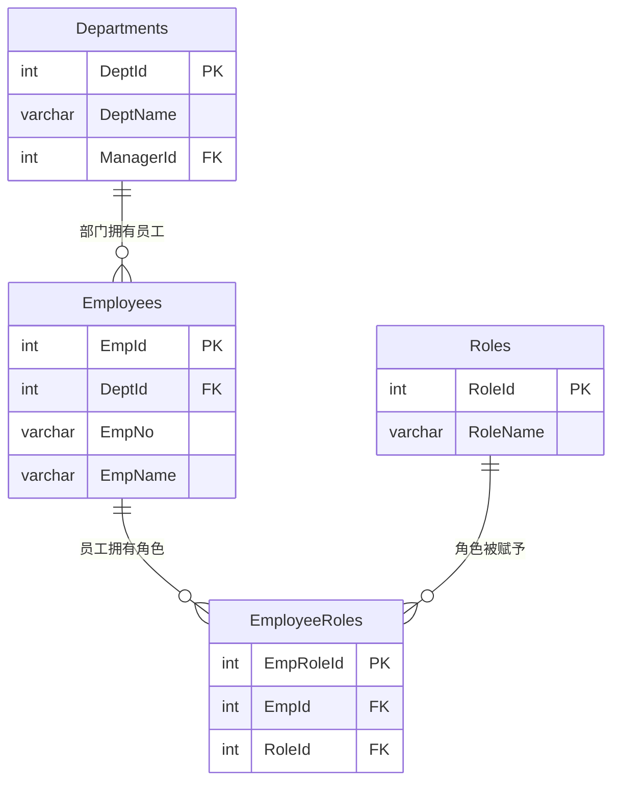
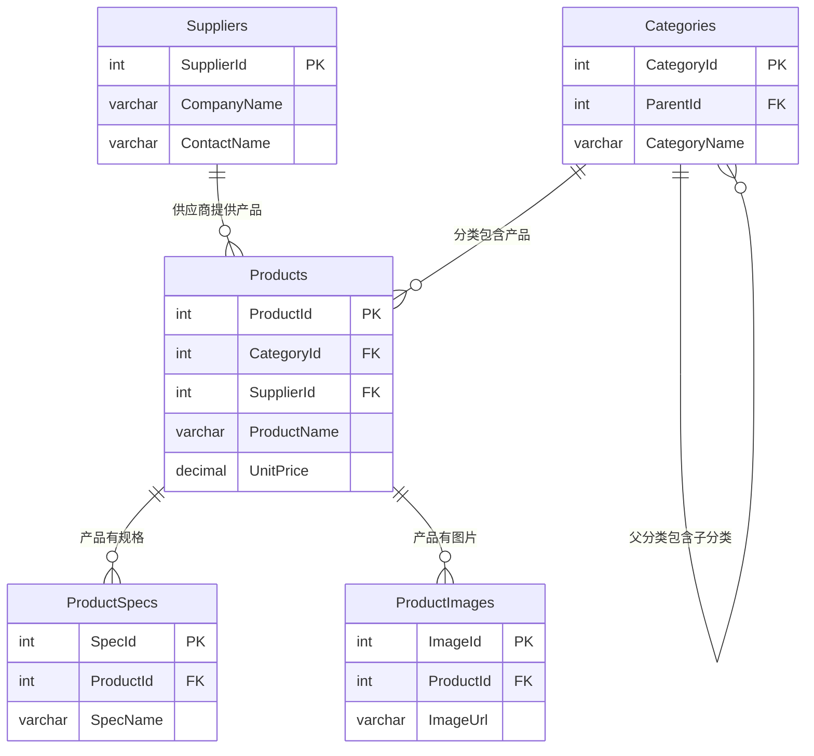
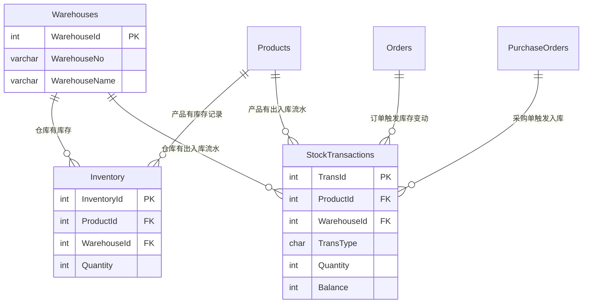
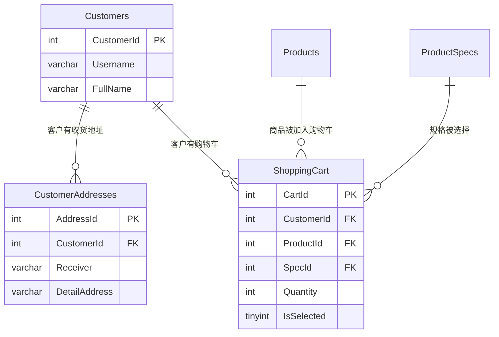
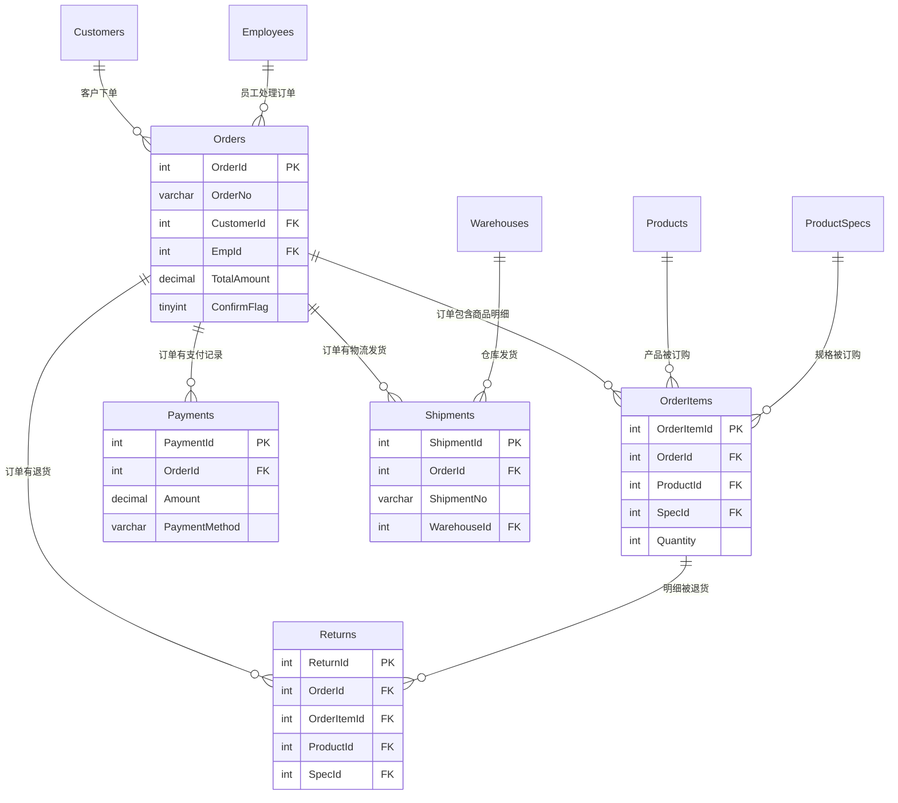
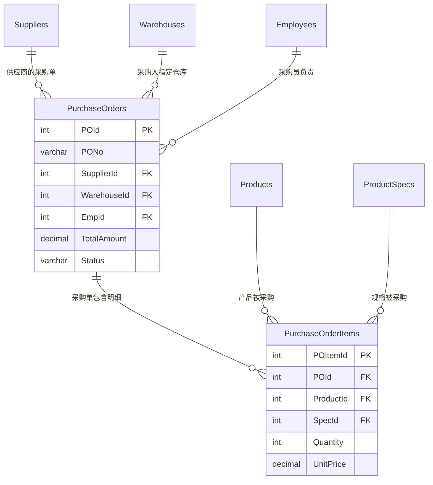
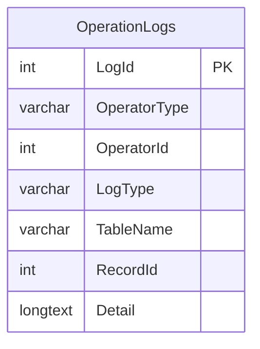
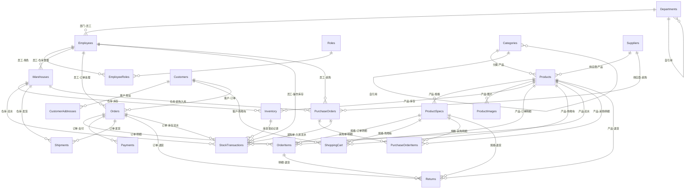

# KCGL 数据库 ER 图 & 表关系说明

---

## 一、模块① 组织权限 ER 图

---

## 二、模块② 产品管理 ER 图

---

## 三、模块③ 仓储库存 ER 图

---

## 四、模块④ 客户购物 ER 图

---

## 五、模块⑤ 订单售后 ER 图

---

## 六、模块⑥ 采购管理 ER 图

---

## 七、模块⑦ 日志审计 ER 图

---

## 八、总体 ER 图（全表关联）

---

## 九、表关系文字说明

### 组织权限模块

| 主表 | 字段 | 方向 | 从表 | 字段 | 关系 | 语义 |
|------|------|:----:|------|------|:----:|------|
| Departments | DeptId | → | Employees | DeptId | **1:N** | 一个部门有多个员工 |
| Departments | ManagerId | → | Employees | EmpId | **1:1** | 一个员工担任部门经理 |
| Employees | EmpId | → | EmployeeRoles | EmpId | **1:N** | 一个员工拥有多个角色 |
| Roles | RoleId | → | EmployeeRoles | RoleId | **1:N** | 一个角色被授予多个员工 |

### 产品管理模块

| 主表 | 字段 | 方向 | 从表 | 字段 | 关系 | 语义 |
|------|------|:----:|------|------|:----:|------|
| Categories | CategoryId | → | Products | CategoryId | **1:N** | 一个分类下有多个产品 |
| Suppliers | SupplierId | → | Products | SupplierId | **1:N** | 一个供应商提供多个产品 |
| Categories | ParentId | → | Categories | CategoryId | **1:N** | 分类自引用（树形层级） |
| Products | ProductId | → | ProductSpecs | ProductId | **1:N** | 一个产品有多个规格 |
| Products | ProductId | → | ProductImages | ProductId | **1:N** | 一个产品有多张图片 |

### 仓储库存模块

| 主表 | 字段 | 方向 | 从表 | 字段 | 关系 | 语义 |
|------|------|:----:|------|------|:----:|------|
| Products | ProductId | → | Inventory | ProductId | **1:N** | 一个产品在多个仓库有库存 |
| Warehouses | WarehouseId | → | Inventory | WarehouseId | **1:N** | 一个仓库有多个产品库存 |
| Products | ProductId | → | StockTransactions | ProductId | **1:N** | 一个产品有多次库存变动 |
| Warehouses | WarehouseId | → | StockTransactions | WarehouseId | **1:N** | 一个仓库有多次库存变动 |
| Orders | OrderId | → | StockTransactions | RefOrderId | **1:N** | 一个订单触发多次库存变动 |
| PurchaseOrders | POId | → | StockTransactions | RefPOId | **1:N** | 一张采购单触发多次入库 |
| Employees | EmpId | → | StockTransactions | OperatorId | **1:N** | 一个员工操作多次库存 |

### 客户购物模块

| 主表 | 字段 | 方向 | 从表 | 字段 | 关系 | 语义 |
|------|------|:----:|------|------|:----:|------|
| Customers | CustomerId | → | CustomerAddresses | CustomerId | **1:N** | 一个客户有多个收货地址 |
| Customers | CustomerId | → | ShoppingCart | CustomerId | **1:N** | 一个客户购物车有多条记录 |
| Products | ProductId | → | ShoppingCart | ProductId | **1:N** | 一个产品被多个客户加入购物车 |
| ProductSpecs | SpecId | → | ShoppingCart | SpecId | **1:N** | 一个规格被多次加入购物车 |

### 订单售后模块

| 主表 | 字段 | 方向 | 从表 | 字段 | 关系 | 语义 |
|------|------|:----:|------|------|:----:|------|
| Customers | CustomerId | → | Orders | CustomerId | **1:N** | 一个客户有多个订单 |
| Employees | EmpId | → | Orders | EmpId | **1:N** | 一个员工处理多个订单 |
| Orders | OrderId | → | OrderItems | OrderId | **1:N** | 一个订单有多个明细 |
| Products | ProductId | → | OrderItems | ProductId | **1:N** | 一个产品出现在多个订单明细中 |
| ProductSpecs | SpecId | → | OrderItems | SpecId | **1:N** | 一个规格出现在多个订单明细中 |
| Orders | OrderId | → | Payments | OrderId | **1:N** | 一个订单有多次支付记录 |
| Orders | OrderId | → | Shipments | OrderId | **1:N** | 一个订单有多次发货 |
| Warehouses | WarehouseId | → | Shipments | WarehouseId | **1:N** | 一个仓库发出多批货物 |
| Orders | OrderId | → | Returns | OrderId | **1:N** | 一个订单有多次退货 |
| OrderItems | OrderItemId | → | Returns | OrderItemId | **1:N** | 一个明细可能分多次退货 |
| Products | ProductId | → | Returns | ProductId | **1:N** | 一个产品被多次退货 |
| ProductSpecs | SpecId | → | Returns | SpecId | **1:N** | 一个规格被多次退货 |

### 采购管理模块

| 主表 | 字段 | 方向 | 从表 | 字段 | 关系 | 语义 |
|------|------|:----:|------|------|:----:|------|
| Suppliers | SupplierId | → | PurchaseOrders | SupplierId | **1:N** | 一个供应商有多张采购单 |
| Warehouses | WarehouseId | → | PurchaseOrders | WarehouseId | **1:N** | 一个仓库接收多张采购单 |
| Employees | EmpId | → | PurchaseOrders | EmpId | **1:N** | 一个采购员负责多张采购单 |
| PurchaseOrders | POId | → | PurchaseOrderItems | POId | **1:N** | 一张采购单有多个明细 |
| Products | ProductId | → | PurchaseOrderItems | ProductId | **1:N** | 一个产品出现在多张采购明细中 |
| ProductSpecs | SpecId | → | PurchaseOrderItems | SpecId | **1:N** | 一个规格出现在多张采购明细中 |

---

## 十、表清单总览

| 编号 | 表名 | 中文字段 | 所属模块 |
|:----:|------|----------|----------|
| 1 | Departments | 部门编号、部门名称、经理编号、描述、创建时间 | 组织权限 |
| 2 | Employees | 员工编号、部门编号、工号、姓名、密码、电话、邮箱、入职日期、是否在职、创建时间 | 组织权限 |
| 3 | Roles | 角色编号、角色名称、描述、创建时间 | 组织权限 |
| 4 | EmployeeRoles | 编号、员工编号、角色编号 | 组织权限 |
| 5 | Categories | 分类编号、父分类编号、分类名称、描述、排序、创建时间 | 产品管理 |
| 6 | Suppliers | 供应商编号、供应商编码、公司名称、联系人、联系电话、地址、邮箱、是否启用、创建时间 | 产品管理 |
| 7 | Products | 产品编号、分类编号、供应商编号、产品编码、产品名称、售价、成本价、单位、描述、是否上架、创建时间 | 产品管理 |
| 8 | ProductSpecs | 规格编号、产品编号、规格名称、库存数量、附加价格、创建时间 | 产品管理 |
| 9 | ProductImages | 图片编号、产品编号、图片地址、排序、是否主图、创建时间 | 产品管理 |
| 10 | Warehouses | 仓库编号、仓库编码、仓库名称、位置、管理员编号、是否启用、创建时间 | 仓储库存 |
| 11 | Inventory | 库存编号、产品编号、仓库编号、当前数量、最低库存、最高库存、最后更新 | 仓储库存 |
| 12 | StockTransactions | 流水编号、产品编号、仓库编号、类型、数量、关联订单、关联采购单、结余、操作人、操作时间、备注 | 仓储库存 |
| 13 | Customers | 客户编号、用户名、密码、真实姓名、电话、邮箱、是否激活、注册时间、最后登录 | 客户购物 |
| 14 | CustomerAddresses | 地址编号、客户编号、收件人、联系电话、省份、城市、区县、详细地址、是否默认、创建时间 | 客户购物 |
| 15 | ShoppingCart | 购物车编号、用户编号、商品编号、规格编号、购买数量、是否选中、加入时间 | 客户购物 |
| 16 | Orders | 订单编号、订单号、客户编号、员工编号、订单日期、订购总额、支付方式、确认标志、地址、邮箱、备注、状态、创建时间 | 订单售后 |
| 17 | OrderItems | 明细编号、订单编号、产品编号、规格编号、数量、单价、小计、创建时间 | 订单售后 |
| 18 | Payments | 支付编号、订单编号、支付单号、支付方式、支付金额、支付时间、状态、备注 | 订单售后 |
| 19 | Shipments | 发货编号、订单编号、物流单号、物流公司、仓库编号、发货日期、签收日期、状态、备注 | 订单售后 |
| 20 | Returns | 退货编号、订单编号、订单明细编号、产品编号、规格编号、退货数量、退货原因、退货日期、状态、备注 | 订单售后 |
| 21 | PurchaseOrders | 采购单编号、采购单号、供应商编号、仓库编号、采购员编号、采购总额、状态、下单日期、预计到货、创建时间 | 采购管理 |
| 22 | PurchaseOrderItems | 明细编号、采购单编号、产品编号、规格编号、数量、单价、小计、创建时间 | 采购管理 |
| 23 | OperationLogs | 日志编号、操作者类型、操作者编号、操作类型、操作表名、记录编号、操作详情、操作时间 | 日志审计 |
